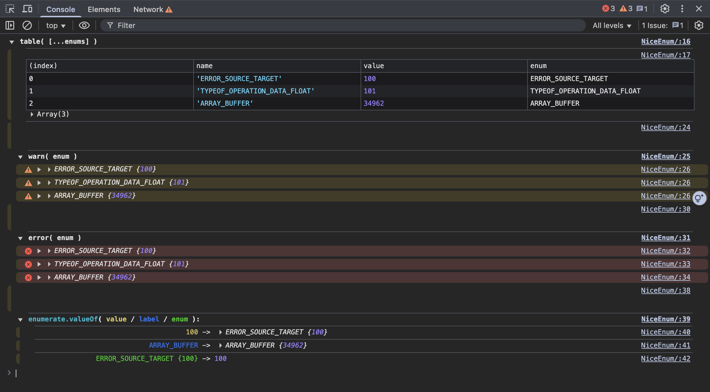

# NiceEnum
<p align="center">
  <br />
  <strong><code>Beautiful, Descriptive, and Safe Enums</code></strong>
  <br />
  A micro-library that gives numbers a name and an identity, turning them into self-descriptive primitives that are a joy to debug and use.
</p>

<p align="center">
  
  
  
</p>
---

In the universe of code, we often speak in numbers. `0`, `1`, `34028`. They are the silent workhorses of our logic. But they are also anonymous, "magic" values, their purpose a mystery to all but their creator. What if we could give them a voice? A name? A soul?

**✨ Welcome to `NiceEnum`. ✨**

`NiceEnum` is not just a utility; it's a philosophy. It transforms plain, forgettable numbers into beautiful, self-aware constants. It’s the "Art of Intelligence" applied to the very primitives of our code, making it more readable, more debuggable, and fundamentally more elegant. It’s the bridge between human-readable names and machine-efficient numbers.



## 🎨 The Vision: Code that Speaks 🎨

We believe code should be clear, expressive, and beautiful. `NiceEnum` was born from the desire to eliminate "magic numbers" and "magic strings," replacing them with constants that carry their own meaning. When you see a `NiceEnum` in the console, it greets you by name. When you use it in a calculation, it behaves like the number it is. It’s the best of both worlds, seamlessly integrated.

## 🚀 Features 🚀

*   **Descriptive Primitives:** Create numbers that know their own name. 🗣️
*   **Beautiful Console Output:** Enums display their name directly in `console.log`, making debugging a dream. 💅
*   **Dual Nature:** Acts as a `number` in numeric contexts (`+`, `-`, `>`) and a `string` in string contexts. 🎭
*   **Type Safety:** Avoid typos and magic values. Each enum is a unique, traceable object. 🛡️
*   **Automatic Values:** If you don't provide a numeric value, `NiceEnum` can assign one for you, either sequentially or based on the name. 🔢
*   **Zero Dependencies:** Pure, elegant, feather-light JavaScript. 🕊️

## 🎬 Show, Don't Tell: The Examples 🎬

### Basic Creation

```javascript
import enumerate from "./index.js";

// Let NiceEnum assign a value automatically
const PENDING = enumerate("PENDING");
const SUCCESS = enumerate("SUCCESS");
const FAILED = enumerate("FAILED");

console.log(PENDING); // Logs: PENDING {0}
console.log(SUCCESS); // Logs: SUCCESS {1}
console.log(FAILED);  // Logs: FAILED {2}

// They behave like numbers in calculations
console.log(`Is SUCCESS greater than PENDING? ${SUCCESS > PENDING}`); // true
```

### Assigning Specific Values

You can easily assign specific, meaningful numbers, like WebGL constants.

```javascript
const ARRAY_BUFFER = enumerate("ARRAY_BUFFER", 34962); // WebGLRenderingContext.ARRAY_BUFFER
const ELEMENT_ARRAY_BUFFER = enumerate("ELEMENT_ARRAY_BUFFER", 34963);

console.log(ARRAY_BUFFER); // Logs: ARRAY_BUFFER {34962}

// It's a real number
console.log(ARRAY_BUFFER + 1); // 34963

// And it's a real name
console.log(`Using buffer: ${ARRAY_BUFFER}`); // Using buffer: ARRAY_BUFFER
```

### Auto-Incrementing Values

Set `enumerate.iterate` to create a sequence of enums.

```javascript
enumerate.iterate = 100;

const ERROR_TIMEOUT = enumerate("ERROR_TIMEOUT");
const ERROR_PERMISSION_DENIED = enumerate("ERROR_PERMISSION_DENIED");

console.log(ERROR_TIMEOUT);             // Logs: ERROR_TIMEOUT {100}
console.log(ERROR_PERMISSION_DENIED); // Logs: ERROR_PERMISSION_DENIED {101}
```

## 🔮 The Magic Revealed 🔮

How does this sorcery work? The secret is a beautiful dance with JavaScript's own prototypes and symbols.

`NiceEnum` creates a tiny, anonymous class that extends `Number` for each enum you define. This gives it the soul of a number. Then, using `Object.defineProperty`, we bestow upon it a `name` and a `value`.

The final touch of magic comes from `Symbol.toPrimitive`. We teach the object how to present itself. When JavaScript expects a number, it reveals its numeric value. When it expects a string (like in `console.log`), it proudly announces its name. It's a perfect harmony of identity and value.

## 🛠️ API Reference 🛠️

### `enumerate(name, [value])`

*   **`name`** `(String)`: The name of the enum. This will be its string representation.
*   **`[value]`** `(Number)`: Optional. The numeric value for the enum. If not provided, a value will be generated automatically.
*   **Returns**: An `Enum` object that acts as both a number and a string.

### `enumerate.iterate`

*   Set `enumerate.iterate` to a `number` to start an auto-incrementing sequence for enums created without an explicit value.

### `enumerate.valueOf(key)`

*   A utility function to retrieve an existing enum.
*   **`key`** `(String | Number | Enum)`: The name, value, or the enum object itself.
*   **Returns**: The corresponding `Enum` object.

## 💖 For the Love of Clean Code 💖

`NiceEnum` is more than a library; it's a love letter to clean, maintainable, and elegant code. It’s for developers who believe that the details matter, and that our tools should be as delightful as the things we build with them.

We invite you to bring this small joy into your projects.

## 🤝 Contributing 🤝

We welcome contributions of all kinds. If you have a feature request, a bug report, or a pull request, please don't hesitate to open an issue or a PR.

## 📜 License 📜

This project is licensed under the MIT License - see the [LICENSE](LICENSE) file for details.